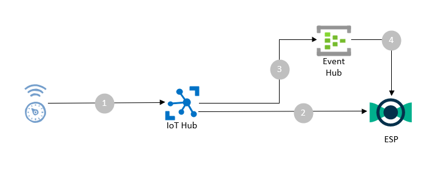
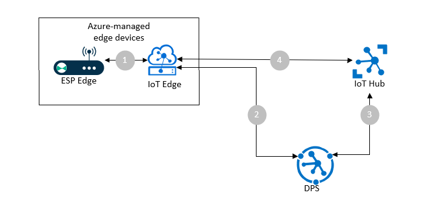
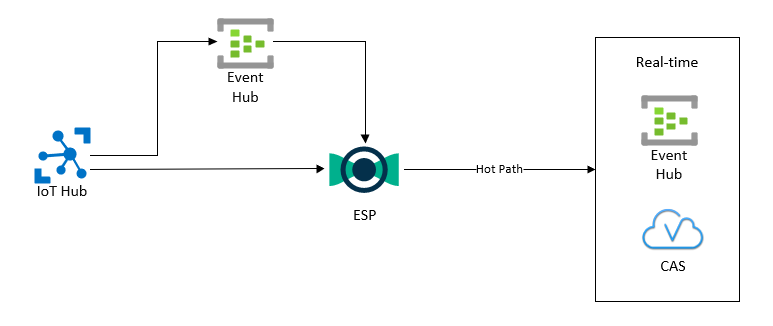
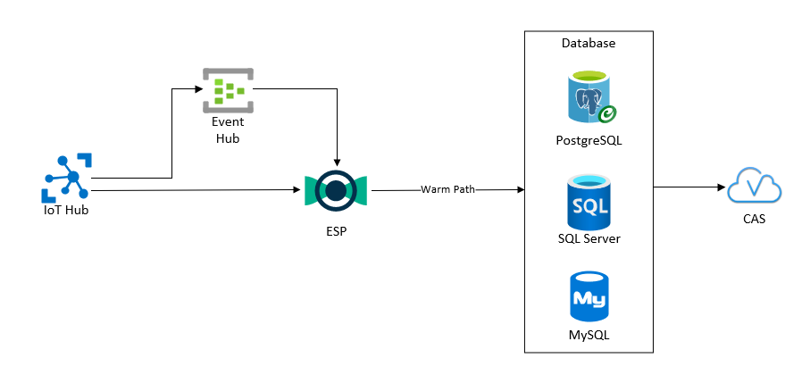
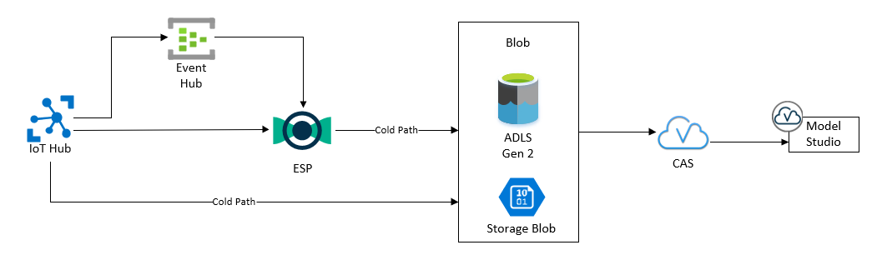

# Azure IoT Reference Architecture
The goal of this project is to define and introduce a high-level reference architecture for use with Azure IoT services and SAS AIoT. This project will help introduce architects to the component Azure services, as well as to understand common integration patterns between these complementary sets of software.

## Table of Contents

* [Simple Cloud Gateway](#simple-cloud-gateway)
* [Azure Managed Edge Device](#azure-managed-edge-device)
* [Storage Architectures](#storage-architectures)
* [Hot Data Path](#hot-data-path)
* [Warm Data Path](#warm-data-path)
* [Cold Data Path](#cold-data-path)
* [Security](#security)
	* [Device](#device)
	* [IoT Hub](#iot-hub)
	* [Azure Cloud Resources](#azure-cloud-resources)
	* [Transport Layer Security (TLS)](#transport-layer-security-(tls))
* [Scalability / Availability](#scalability-/-availability)
* [Contributing](#contributing)
* [License](#license)

# Architecture Overview
This architecture attempts to cover well-known integration points between ESP and ESP Edge and the Azure services (as shown in the below architecture diagram). It does not necessarily cover every service that may be required to develop a solution, nor can it cover every use case.

# Components
First, let's define the components of an IoT architecture: 

**Telemetry** Telemetry is in-situ collection of measurements and other data that is transmitted for monitoring. While not an architecture component per se, telemetry underpins the design of an architectured - it is the very reason the architecture exists. In these architectures, telemetry will always be an device-to-cloud message.

**IoT Devices** 
The focus of any Azure IoT architecture begins with the devices from which telemetry may be collected. There are 3 general classifications of these edge devices:
- **Legacy Devices** These devices include PLCs and MCUs which do not have the capability to transmit data directly to the cloud gateway (e.g. a device which requires a serial connection to an edge device, or a device which may not connect to the cloud gateway by virtue of its network security configuration). These devices instead must be connected to an edge gateway, that may both proxy connectivity to the cloud gateway, as well as provide protocol translation of the connected device. One example of this is the [Modbus gateway](https://docs.microsoft.com/en-us/azure/iot-edge/deploy-modbus-gateway?view=iotedge-2018-06).
- **Connected Unmanaged Devices** These are devices which have the ability to directly transmit telemetry data to the cloud gateway (i.e. they are networked, with the ability to connect directly to the cloud gateway). These devices support one of the supported gateway protocols: AMQP, MQTT, or HTTPS. They may have various means of connectivity (Ethernet, 3G/4G/5G wireless connectivity, LPWAN (like LoRaWan), etc.), but as long as the connectivity supports the telemetry data requirements, this exact type of connectivity does not matter. 
- **Cloud-managed devices** These are IoT devices which have both the ability to transmit device telemetry to the cloud, as well as the ability to be managed from the cloud. In these Azure-based architectures, this will be via the Azure IoT SDKs, but this could also be through third-party device management solutions.  In Azure IoT these fall under two categories IoT devices and IoT Edge devices.  IoT devices run the Azure IoT SDK and could be MCUs or even PC hardware primarily transmitting sensor data to a cloud or edge gateway.  For more complex edge processing the Azure IoT Edge runtime is used.  These devices will generally have more resources (CPU/Memory/Disk) than the other classes of devices, in order to support these additional features such as edge analytics and edge gateway functions.

**Cloud Gateway/Data Ingestion Service** 
The cloud gateway provides a cloud entry-point for devices to connect with. It will support many different functionalities, such as: device registration and provisioning, and device management; but at the very least it will allow for devices to transmit telemetry data. With Azure cloud, this is generally going to be the [Azure IoT Hub](https://docs.microsoft.com/en-us/azure/iot-hub/about-iot-hub) service. However, it may also be other message brokers (e.g. [Event Hubs](https://azure.microsoft.com/en-us/services/event-hubs/), [Service Bus](https://azure.microsoft.com/en-us/services/service-bus/)) if the device management capabilities are not required.

**Edge Gateway**
The edge gateway provides a proxied endpoint to the cloud gateway for device telemetry. This may be as a [transparent gateway](https://docs.microsoft.com/en-us/azure/iot-edge/how-to-create-transparent-gateway?view=iotedge-2018-06), where the devices are registered with this edge gateway. Or it may be through functionality such as that provided by the [IoT Edge Hub](https://docs.microsoft.com/en-us/azure/iot-edge/iot-edge-runtime?view=iotedge-2018-06#iot-edge-hub).

**Stream Analytics** 
A stream analytics service provides the ability to apply analytics to streaming data, in order to provide real-time inferencing. There are several options to use for streaming analytics in the Azure cloud, but these architectures will exclusively use SAS Event Stream Processing as our edge and cloud stream processing engines.

**Storage** 
An important aspect of the analytics life-cycle is retaining a collection of data to use for training or refining analytical models. We'll primarily store this data in database or data lake storage. The architectures will provide several different suggested implementations for doing this.

# Modular Architectures
In this section, we will define modular component architectures that may be used as building blocks for developing a holistic IoT Solution architecture.

## Simple Cloud Gateway

The most basic implementation of an IoT architecture. It consists of an edge device which can communicate natively with IoT Hub. 
1. Edge Device connects to IoT Hub directly via a supported protocol (AMQP/MQTT/HTTPS). The device transmits telemetry payload (which may be in any form, although CSV and JSON are common) directly to the IoT Hub.
2. ESP then subscribes to the IoT Hub via the [Event Hub connector](http://pubshelpcenter.unx.sas.com:8080/test/doc/en/espcdc/v_006/espca/n1taf3y2zsqskon115o5vjbueevf.htm) (as IoT Hub provides an Event Hub compatible endpoint).
3. Alternately, instead of ESP subscribing directly to IoT Hub, instead route messages from IoT Hub to an Event Hub (using the message routing features in IoT Hub). 
4. ESP then subscribes to the Event Hub endpoint using the [Event Hub connector](http://pubshelpcenter.unx.sas.com:8080/test/doc/en/espcdc/v_006/espca/n1taf3y2zsqskon115o5vjbueevf.htm).

## Azure Managed Edge Device

In this architecture, we will introduce several of the management capabilities of IoT Hub.
1. IoT Edge runtime instantiates an ESP Edge module (container) on the edge device, as specified in the device [deployment manifest](https://docs.microsoft.com/en-us/azure/iot-edge/module-composition?view=iotedge-2018-06). The ESP Edge module can then communicate with the [IoT Edge Hub](https://docs.microsoft.com/en-us/azure/iot-edge/iot-edge-runtime?view=iotedge-2018-06#iot-edge-hub), in a bi-directional manner using the [IoT Edge Hub Connector](http://pubshelpcenter.unx.sas.com:8080/test/doc/en/espcdc/v_006/espca/p02sff1wxyequ7n1sfep4bow9w7e.htm). For full details about Azure IoT Edge integration with ESP Edge , please refer to [this project](https://gitlab.sas.com/IOT/reference-architectures/sas-esp-azure-iot-edge-architecture).
2. [Azure Device Provisioning Service](https://docs.microsoft.com/en-us/azure/iot-dps/about-iot-dps) is a helper service for IoT Hub, which provides provisioning and configuration for edge devices. The edge device is initially configured to register with DPS, and IoT Edge contacts this endpoint during initial startup. 
3. DPS validates the device against an enrollment list, and then registers the new device with the correct IoT Hub. It then returns the connection information for IoT Hub to the edge device.
4. IoT Edge connects to IoT Hub, and gets its desired state from the device twin registered in IoT Hub.

## Storage Architectures
There are many ways to architect storage in an IoT Solution.  Storage architecture is about balancing business value with storage costs.  Data storage resources that are real-time and accessed frequently are more expensive than storage that is accessed infrequently such as for data science queries.  For this reason, it is helpful to break the different storage requirements into three tiers based upon the data path:
- **Hot Path** Data which is frequently written, frequently accessed, and considered most time-critical. This may be a subset of the telemetry data - only that which contains alerts or other important criteria.
- **Warm Path** Data which is updated periodically (e.g. minutes timescale), accessed periodically, and for which a short time lag is acceptable. Like the hot path, this may not contain all device telemetry - only that which is important for monitoring. It may also contain data that has been transformed (e.g. aggregations by time).
- **Cold Path** Data which is infrequently written (e.g. hourly or longer), infrequently accessed, and generally only used for historical retrieval. This should contain all telemetry, as it will be used to create analytical models.

For these data paths, it is important to understand that you must understand the holistic data flow between services - as selecting the appropriate service is only part of the equation. It is also important that you construct your ESP projects appropriately to accomplish your objective.

## Hot Data Path

The hot data path includes the data which is most time-critical. It is therefore important to select services which operate in a real-time fashion. Message queues and busses are ideally suited to this type of flow, and in Azure this will generally mean [Event Hubs](https://azure.microsoft.com/en-us/services/event-hubs/), [Service Bus](https://azure.microsoft.com/en-us/services/service-bus/), or [Event Grid](https://docs.microsoft.com/en-us/azure/event-grid/overview). ESP now has a native connector for Event Hubs, which is why we have highlighted it here.

Another possible service could be SAS Cloud Analytic Services. ESP may publish directly into CAS using the CAS adapter, which is useful for real-time dashboard in Visual Analytics. As noted in the previous section however, take careful consideration of your ESP project when attempting to publish real-time data. Event retention settings and adapter properties can greatly affect the latency of the data. For example, it may be necessary to adjust the `commitblocks` parameter for the CAS adapter to a lower value to achieve a lower latency.

## Warm Data Path

For the warm data path, we are generally working with data which must be timely, but for which a short time lag is acceptable.  This includes constructs such as data warehouses, which generally use relational databases as the backing store. ESP provides a database adapter/connector for many types of relational databases, and ODBC drivers for those that are not explicitly listed.   

Azure offers many database options: PaaS offerings and managed instances; relational, document and key-value stores; as well as the ability to run your own selection on IaaS. A listing of the various PaaS and managed instances may be found [here](https://azure.microsoft.com/en-us/product-categories/databases/).

If we choose to restrict our focus to PaaS relational DB offerings with ESP support, then we are left with three options: PostgreSQL, SQL Server, and MySQL. Details on how to connect ESP to [PostgreSQL](https://gitlab.sas.com/IOT/tutorials/ESP-tutorials/how-to-integrate-esp-with-relational-databases-using-db-connector#steps-to-connect-to-azure-database-for-postgresql) and [SQL Server](https://gitlab.sas.com/IOT/tutorials/ESP-tutorials/how-to-integrate-esp-with-relational-databases-using-db-connector#steps-to-connect-to-microsoft-azure-sql-database) in Azure can be found by clicking on these links. CAS may also use these relation databases as a library.

As discussed above, the true distinction between a warm and hot data path depend not only on the chosen services, but on the configuration of these services as well. If you choose to adjust the ESP connector options to minimize latency, it may be entirely valid to consider these as part of the hot data path instead. 

## Cold Data Path

The cold data path generally includes all telemetry data. It is expected to be queried infrequently, and therefore the predominant concerns are not about query performance, but about cost. As such, this is generally blob or data lake (e.g. HDFS) oriented.

Azure IoT Hub has pre-defined endpoints for routing messages, one of which is to a storage account. By configuring this routing, all telemetry data can be automatically archived into either Blob storage, or Azure Data Lake Storage Gen. 2. The data is archived according to a hierarchical calendar format, in either Avro or JSON format. For full details on how to configure this feature, see the documentation [here](https://docs.microsoft.com/en-us/azure/iot-hub/iot-hub-devguide-messages-d2c#azure-storage-as-a-routing-endpoint).

Likewise, ESP may also publish to Azure Storage. Azure Data Lake Gen. 2 is built upon Blob storage, but has an API designed to provide compatibility with Apache HDFS. In fact, there is an [Azure Blob File System](https://docs.microsoft.com/en-us/azure/storage/blobs/data-lake-storage-abfs-driver) (ABFS) driver included in the base Apache Hadoop distribution, which may be used in concert with the ESP HDFS adapter to write to this storage. 

There is no such driver or adapter for the base Blob storage, but there is a complete REST API available for creating blobs. Through careful usage of the ESP REST Subscriber, it should be possible to write events to blob storage through this [API](https://docs.microsoft.com/en-us/azure/storage/blobs/data-lake-storage-abfs-driver).

You may then import this data into Viya (and CAS) via the [Azure Data Lake Storage](https://go.documentation.sas.com/?cdcId=pgmsascdc&cdcVersion=9.4_3.5&docsetId=casref&docsetTarget=n1ogaeli0qbctqn1e3fx8gz70lkq.htm&locale=en) libname option, to be used for further analyses (e.g. creation of models in Model Studio). However, do note that there are limitations regarding the file types that may be retrieved with this libname - so there may be translation steps required.

# Considerations
## Security

### Device

IoT Hub provides 3 options for device authentication, which can fulfill most needs. Device authentication options provided by IoT Hub are as follows:

- **X.509 Certificates:** IoT Hub can authenticate devices with self signed or CA issued root certificates. Root certificates can be chained and intermediate certificates can be used for authentication when presented with a chain of root, intermediaries, and leaf certificates. IoT Hub also supports authenticating devices using only device leaf certificates. This is the most secure type of authentication provided by IoT Hub. Certificates can be revoked from the IoT Hub in cases where the device gets compromised.
- **Trusted Platform Module (TPM):** TPM refers to a standard for securely storing keys to authenticate the platform. TPM can be exist as hardware, integrated hardware, firmware or software modules. TPM chips can store X509 certificates as well. TPM is more secure than symmetric key authentication.
- **Symmetric Key:** A symmetric key is known both to the device and the IoT Hub and this key is used to encrypt and decrypt messages sent between IoT Hub and the device. IoT Hub supports shared access signature (SAS) token based symmetric keys. Symmetric keys can be secured using Hardware Security Modules (HSM). Implementing symmetric key authentication is the easiest and least complicated way to get started with device authentication, although on its own symmetric key authentication is less secure then TPM or X.509. Symmetric keys can be revoked from the IoT Hub if the device gets compromised.

### IoT Hub

Access control and permissions to the IoT Hub are controlled via shared access policies. These policies can be defined in Azure portal or programmatically by using the IoT Hub REST APIs or using the Azure CLI.

### Azure Cloud Resources

Access management for cloud resources is of paramount importance for any organization that utilizes cloud. Azure Role Based Access Controls (RBAC) helps manage access to Azure resources, permissions for these resources and what areas they have access to. Azure RBAC is a built-in authorization system built on Azure Resource Manager to provide fine-grain access management of Azure resources.

### Transport Layer Security (TLS)

Azure IoT Hub uses TLS to secure connections from devices and services, currently 3 versions of TLS are supported viz 1.0, 1.1, 1.2. IoT Hub uses Baltimore Cybertrust CA as its root certificate. After a successful TLS handshake IoT Hub authenticates a device using X.509 certificate or TPM or Symmetric Key.

## Scalability / Availability
With the release of Viya 4, users now have the ability to take advantage of a variety of cloud-native features, including:
- **Containerized deployment** Through the use of Kubernetes, in the form of Azure Kubernetes Service in Azure Cloud, Viya services may be deployed in an environment which provides numerous cloud-native features as a baseline. One of these is the deployment of immutable pods, which are just containerized versions of the individual services.
- **Autoscaling of ESP Projects** ESP pods may be dynamically scaled according to the load on the system. This is accomplished through the application of a kubernetes operator, the [ESP Operator](https://github.com/sassoftware/esp-kubernetes), to the deployment. The architect merely specifies the desired operating threshold for these pods, and the operator will monitor and adjust the scaling to an appropriate level through the use of the kubernetes [horizontal pod autoscaler (HPA)](https://kubernetes.io/docs/tasks/run-application/horizontal-pod-autoscale/). However, this feature only applies to ESP projects wherein state does not need to be shared amongst the pods, so great care must be taken to ensure this is achieved. 
- **Resilient Storage** Azure Storage provides multiple resiliency options for storage. Azure Storage is directly addressable within AKS as [persistent volume](http://pubshelpcenter.unx.sas.com:8080/test/doc/en/espcdc/v_006/espex/n19tbdmek5u0rdn1f31lktl95r27.htm) storage classes, making it easy to add resilient storage to the solution. By choosing to implement either Locally/Zone/Geo Redundant Storage, highly-available redundant storage should prevent a storage outage affecting the solution.
- **High-availability** To provide a truly highly-available solution, careful consideration must be given to each piece of the solution. A failure or temporary delay in any individual component may cripple the entire solution, so each piece must be addressed in turn. Starting from the Azure PaaS services, most have service level agreements (SLAs) of at least 99.9% availability in the basic tiers, with increasing availability SLAs as you progress up the tier structure. It is up to the architect to decide what level satisfies the needs of the solution, and to choose the appropriate tier. 
In addition to the services, there are techniques that may be applied to a solution containing ESP. One example, is to utilize 
[ESP Routers](https://gitlab.sas.com/IOT/tutorials/esp-routers) to distribute load across an autoscaling deployment of ESP pods.

# Deployment

An IoT solution needs to manage edge and cloud changes securely and predictably.  In the IoT Hub, edge deployments should be used and built with Azure IoT best practices.  This includes configuring edge modules to use the module twin for configuration and state.  Using the module twin for the configuration of a module allows using the device provisioning service to specify a default module configuration. It also allows tagging edge devices with meta-data to deploy different software or configurations.  Using the Device Provisioning Service (DPS) allows creating enrollments for different types of devices, and these enrollments then allow a device to be automatically provisioned and assigned to an IoT Hub.  The DPS can also load balance between multiple IoT Hubs allowing an IoT Solution to scale or have redundancy between regions.

Another key is using Infrastructure as Code (IaC) to describe edge and cloud resources.  ARM templates for Azure specific templates or Terraform can be used to describe all cloud resources, then scripts can be source controlled and used to automate creation of these resources.   For the edge configuration in Azure, the deployment manifest can be used to describe edge devices and enable Infrastructure as Code principles.

To enable Continuous Integration/Continuous Delivery (CI/CD) of any project components deployed to the edge or cloud, Azure Devops may be used. The Azure Devops Pipelines can be used to build all docker images.  Additionally, there are plugins to communicate with the Azure IoT Hub.  By describing the edge device in a deployment manifest an [Azure Devops Edge CI/CD Pipeline](https://docs.microsoft.com/en-us/azure/iot-edge/how-to-continuous-integration-continuous-deployment?view=iotedge-2018-06) can publish new containers, update edge configuration and report edge device statuses.

Azure IoT devices can also take advantage of the [Azure IoT Hub Device Update](https://docs.microsoft.com/en-us/azure/iot-hub-device-update/understand-device-update) feature.  This allows updates of the Operating System and software installed on the device to be managed in the cloud with IoT Hub.

# Next Steps
For detailed information about Azure IoT Edge, including details regarding managing ESP Edge via Azure, consult the following project:
- [IoT Edge reference architecture](https://gitlab.sas.com/IOT/reference-architectures/)

## Contributing

**Required**. Use the default text below if you accept contributions. If you do not accept contributions (e.g., a samples project), note that here.

> We welcome your contributions! Please read [CONTRIBUTING.md](CONTRIBUTING.md) for details on how to submit contributions to this project. 

## License

**Required**. Use the default text below. **NOTE:** Nothing different should be used here without prior approval of SAS Legal.

> This project is licensed under the [Apache 2.0 License](LICENSE).

# Additional Resources
Azure Documentation:
- [Azure IoT Hub](https://docs.microsoft.com/en-us/azure/iot-hub/about-iot-hub)
- [Event Hubs](https://azure.microsoft.com/en-us/services/event-hubs/)
- [Service Bus](https://azure.microsoft.com/en-us/services/service-bus/)
- [Azure Database Options](https://azure.microsoft.com/en-us/product-categories/databases/)
- [Azure Devops Edge Pipeline](https://docs.microsoft.com/en-us/azure/iot-edge/how-to-continuous-integration-continuous-deployment?view=iotedge-2018-06)
- [Azure RBAC](https://docs.microsoft.com/en-us/azure/role-based-access-control/overview)
- [TLS Security in IoT Hub](https://docs.microsoft.com/en-us/azure/iot-hub/iot-hub-tls-support)

ESP Documentation:
- [Event Hub connector/adapter](http://pubshelpcenter.unx.sas.com:8080/test/doc/en/espcdc/v_006/espca/n1taf3y2zsqskon115o5vjbueevf.htm)
- [Iot Edge Hub connector/adapter](http://pubshelpcenter.unx.sas.com:8080/test/doc/en/espcdc/v_006/espca/p02sff1wxyequ7n1sfep4bow9w7e.htm)

Reference Architectures:
- [IoT Edge reference architecture](https://gitlab.sas.com/IOT/reference-architectures/)

